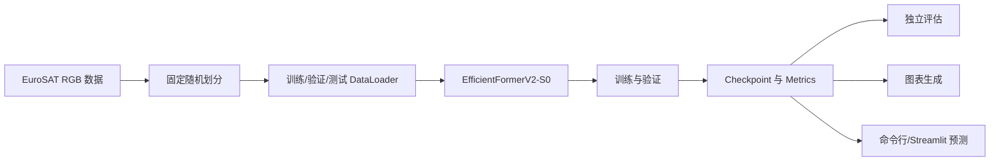
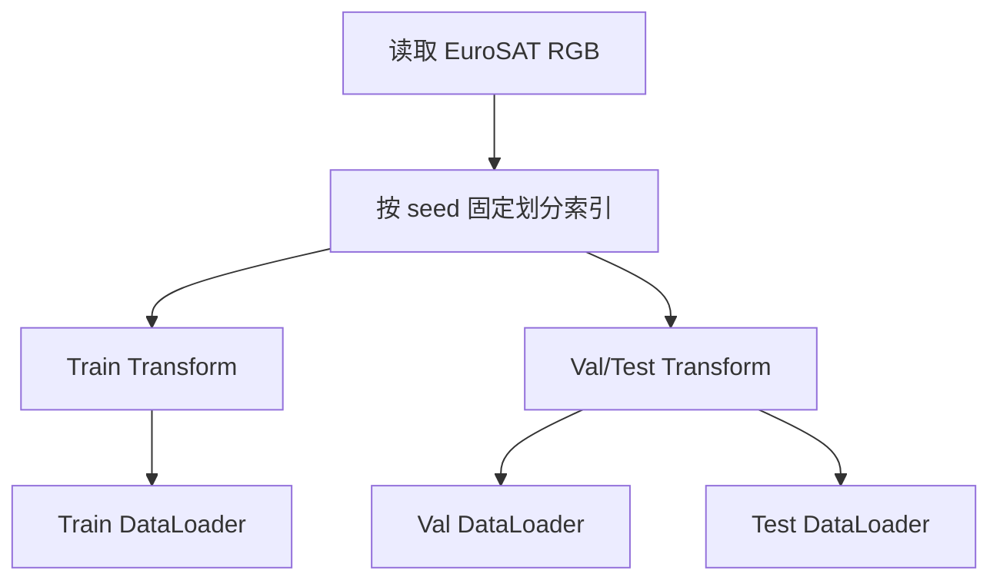

# 基于 EfficientFormerV2 与增强训练策略的 EuroSAT 遥感土地利用图像分类系统设计与实现

本文档是结题报告/论文初稿，可在学校 DOCX 模板中进一步排版。若提交正式版本，需要将本地 `outputs/figures/` 中的图片插入模板，并按学校格式补充封面、目录、页眉页脚和参考文献格式。

## 摘要

遥感土地利用图像分类是遥感智能解译中的基础任务，在农业监测、城市规划、生态环境分析和灾害评估等场景中具有重要应用价值。针对遥感图像类别差异细微、背景复杂以及模型部署成本等问题，本文设计并实现了一个基于 EfficientFormerV2 的 EuroSAT 遥感土地利用图像分类系统。

系统以 EuroSAT RGB 数据集为实验对象，将数据划分为训练集、验证集和测试集，使用 timm 提供的 EfficientFormerV2-S0 预训练模型作为主干网络，并替换分类头以适配 10 类土地利用分类任务。在训练策略方面，本文实现了基线训练方案，并进一步加入 ColorJitter、Mixup 和 Label Smoothing 等增强训练策略进行对比实验。系统同时提供命令行训练、独立评估、实验汇总、图表生成、单图预测和 Streamlit Web 演示界面。

初步实验结果表明，EfficientFormerV2-S0 能够在较短训练流程下学习到有效的遥感图像特征。当前 100 batch 基线模型在验证集 480 个样本上达到 0.7729 准确率，在完整测试集 4050 个样本上达到 0.7748 准确率。增强训练策略在短训练条件下未超过基线准确率，但获得了更低的验证损失，说明其可能改善模型输出分布和泛化潜力。本文最后对系统实现、实验结果、类别混淆现象和后续优化方向进行了总结。

关键词：遥感图像分类；EuroSAT；EfficientFormerV2；数据增强；深度学习

## Abstract

Land use and land cover classification from remote sensing images is a fundamental task in intelligent Earth observation. It supports applications such as agricultural monitoring, urban planning, ecological analysis and disaster assessment. To address the challenges of subtle inter-class differences, complex image backgrounds and deployment efficiency, this project designs and implements a EuroSAT land use classification system based on EfficientFormerV2.

The system uses the RGB version of the EuroSAT dataset and splits it into training, validation and test subsets. An ImageNet-pretrained EfficientFormerV2-S0 model from timm is adopted as the backbone, and its classification head is replaced for the 10-class EuroSAT task. In addition to a baseline training setting, this project implements enhanced training strategies including ColorJitter, Mixup and Label Smoothing. The system also provides command-line training, independent evaluation, experiment summarization, figure generation, single-image prediction and a Streamlit-based web demo.

Preliminary results show that EfficientFormerV2-S0 can learn effective remote sensing image features within a short training budget. The current 100-batch baseline model achieves 0.7729 validation accuracy on 480 validation samples and 0.7748 accuracy on the full test split with 4050 samples. The enhanced setting does not outperform the baseline in short training, but it obtains a lower validation loss, suggesting potential improvements in output calibration and generalization under longer training. The project provides a complete, reproducible implementation basis for further experiments and report writing.

Keywords: remote sensing image classification; EuroSAT; EfficientFormerV2; data augmentation; deep learning

## 第 1 章 绪论

### 1.1 研究背景

遥感影像能够从宏观尺度记录地表覆盖和土地利用状态，是地理信息科学、生态环境监测和智慧城市建设的重要数据来源。随着卫星成像技术和公开遥感数据集的发展，利用深度学习方法自动识别遥感图像中的土地利用类别，已经成为遥感智能处理的重要研究方向。

传统遥感图像分类方法通常依赖人工特征、光谱指数或浅层机器学习算法，对复杂场景的表达能力有限。深度卷积神经网络能够自动学习图像的多层次特征，在自然图像和遥感图像分类任务中均取得较好效果。近年来，视觉 Transformer 及其轻量化变体进一步提升了图像建模能力，为遥感场景分类提供了新的技术路线。

遥感图像分类任务仍存在一定挑战。首先，不同土地利用类别之间可能具有相似纹理，例如 River、Highway 和 PermanentCrop 等类别在局部纹理上可能产生混淆。其次，同一类别在不同地区、季节和成像条件下可能存在明显差异。最后，模型不仅需要较高准确率，也需要兼顾训练成本、推理效率和系统可演示性。

### 1.2 研究意义

本文选择 EfficientFormerV2 作为主干模型，是因为该模型兼顾 Transformer 表达能力和轻量化推理效率，适合构建中小规模遥感图像分类系统。通过在 EuroSAT 数据集上完成数据处理、模型训练、增强策略对比、结果分析和 Web 演示，可以形成一个端到端的遥感土地利用分类原型。

从工程实践角度看，本项目不仅关注模型本身，也关注实验可复现、结果可整理、过程可追踪和系统可展示。项目中建立了配置文件、开发日志、实验汇总、图表生成和公开仓库同步规范，有助于后续扩展实验或撰写正式论文。

### 1.3 主要工作

本文主要完成以下工作：

- 构建 EuroSAT RGB 数据加载、固定随机划分和图像预处理流程。
- 使用 EfficientFormerV2-S0 预训练模型实现 10 类土地利用分类。
- 实现基线训练、增强训练、独立评估、实验汇总和可视化工具。
- 对比 baseline 与 enhanced 配置在限制 batch 条件下的实验结果。
- 实现命令行单图预测和 Streamlit Web 演示界面。
- 整理技术文档、开发日志、实验结果和报告草稿，保证项目过程可追溯。

### 1.4 章节安排

第 1 章介绍研究背景、意义和主要工作。第 2 章介绍 EuroSAT 数据集、EfficientFormerV2 模型和增强训练策略。第 3 章说明系统总体设计和关键模块实现。第 4 章给出实验设置、实验结果和类别表现分析。第 5 章介绍 Web 演示系统。最后总结项目成果、不足和后续改进方向。

## 第 2 章 相关技术与数据集

### 2.1 EuroSAT 数据集

EuroSAT 是一个面向土地利用和土地覆盖分类的遥感图像数据集，基于 Sentinel-2 卫星图像构建。数据集包含 10 个类别，项目中使用 RGB 图像版本。类别如下：

| 序号 | 类别 |
| ---: | --- |
| 1 | AnnualCrop |
| 2 | Forest |
| 3 | HerbaceousVegetation |
| 4 | Highway |
| 5 | Industrial |
| 6 | Pasture |
| 7 | PermanentCrop |
| 8 | Residential |
| 9 | River |
| 10 | SeaLake |

本项目按照固定随机种子将数据划分为训练集、验证集和测试集，比例为 70%、15%、15%。实际划分结果如表所示：

| Split | Samples |
| --- | ---: |
| Train | 18900 |
| Val | 4050 |
| Test | 4050 |

固定划分能够保证不同训练配置之间具有可比性，也方便独立评估脚本复现实验结果。

### 2.2 EfficientFormerV2

EfficientFormerV2 是面向轻量化视觉任务设计的高效视觉模型。它关注模型准确率、参数量和推理速度之间的平衡，适合部署资源有限但仍需要较强图像表征能力的应用场景。

本项目使用 timm 库提供的 `efficientformerv2_s0`，并加载 ImageNet 预训练权重。模型输入为 224 x 224 RGB 图像，输出为 10 维 logits。实现时替换模型分类头，使其适配 EuroSAT 的 10 类分类任务。当前模型参数量约为 3.25M，适合本地快速实验和 Web 演示。

### 2.3 迁移学习

遥感数据集规模通常小于大型自然图像数据集。如果从随机初始化开始训练，模型容易受到训练样本规模和计算资源限制。迁移学习通过加载 ImageNet 等大规模数据集上的预训练权重，使模型在初始阶段已经具备通用视觉特征表达能力，再针对目标数据集进行微调。本文采用预训练 EfficientFormerV2-S0 作为起点，以提升训练效率和短程实验效果。

### 2.4 增强训练策略

为了提升模型鲁棒性和泛化能力，本文实现了多种增强训练策略：

- RandomResizedCrop：随机裁剪并缩放图像，增强模型对尺度变化的适应能力。
- RandomHorizontalFlip：对训练图像进行随机水平翻转，提升空间变换鲁棒性。
- ColorJitter：随机调整亮度、对比度和颜色，模拟不同成像条件。
- Mixup：将不同样本和标签进行线性混合，缓解模型过拟合。
- Label Smoothing：降低模型对单一标签的过度置信，改善输出分布。

本文设置 baseline 和 enhanced 两组配置。baseline 关闭 Mixup 和 ColorJitter，enhanced 启用 Mixup、ColorJitter 和 Label Smoothing，用于观察增强策略对训练效果的影响。

## 第 3 章 系统设计与实现

### 3.1 总体设计

系统采用模块化设计，核心流程包括数据读取、图像预处理、模型构建、训练验证、独立评估、实验汇总、图表生成和交互式预测。



项目目录结构如下：

| 路径 | 作用 |
| --- | --- |
| `configs/` | 保存 baseline、enhanced 和 default 配置 |
| `src/eurosat_landuse/data.py` | 数据集下载、划分、transform 和 dataloader 构建 |
| `src/eurosat_landuse/model.py` | EfficientFormerV2 模型构建和参数统计 |
| `src/eurosat_landuse/train.py` | 训练循环、验证循环、Mixup 和 checkpoint 保存 |
| `src/eurosat_landuse/evaluate.py` | checkpoint 评估、逐类准确率和混淆矩阵 |
| `src/eurosat_landuse/predict.py` | 单图 Top-k 预测 |
| `src/eurosat_landuse/summarize_experiments.py` | 汇总 metrics JSON |
| `src/eurosat_landuse/plot_experiments.py` | 生成实验图表 |
| `app/streamlit_app.py` | Web 演示界面 |

### 3.2 数据模块设计

数据模块负责读取 EuroSAT RGB 数据集，并按照配置中的比例和随机种子划分 train、val 和 test。训练阶段使用随机增强，验证和测试阶段使用确定性变换。这样既能提升训练数据多样性，又能保证评估结果稳定。

数据处理流程如下：



### 3.3 模型模块设计

模型模块通过 timm 创建 EfficientFormerV2-S0，并将分类头调整为 10 类输出。模型构建函数同时支持配置中的模型名解析，避免不同 timm 版本下模型名称差异导致训练入口无法运行。

### 3.4 训练模块设计

训练脚本读取 YAML 配置后，构建数据加载器、模型、损失函数和优化器。每个 epoch 包含训练和验证两个阶段，并记录 loss 与 accuracy。验证准确率超过历史最佳结果时保存 checkpoint。训练指标保存为 JSON，方便后续汇总。

训练入口示例：

```bash
python -m src.eurosat_landuse.train --config configs/baseline.yaml --download --epochs 1 --batch-size 16 --max-train-batches 100 --max-val-batches 30 --run-name baseline_100b
```

### 3.5 评估与可视化模块设计

评估脚本独立加载 checkpoint，在指定 split 上计算 loss、accuracy、per-class accuracy 和 confusion matrix。可视化脚本读取实验汇总或评估 JSON，生成准确率对比图、损失对比图、混淆矩阵和每类准确率图。

评估入口示例：

```bash
python -m src.eurosat_landuse.evaluate --config configs/baseline.yaml --checkpoint outputs/checkpoints/baseline_100b_best.pt --split test --batch-size 16 --max-batches 30 --run-name baseline_100b_eval_test
```

### 3.6 预测与 Web 演示模块设计

预测模块负责加载 checkpoint、读取单张图像、执行模型推理并输出 Top-k 预测结果。Streamlit 界面复用该逻辑，提供 checkpoint 选择、设备选择、Top-k 设置和图像上传功能，使用户可以直观体验分类系统。

## 第 4 章 实验设计与结果分析

### 4.1 实验环境

| 项目 | 配置 |
| --- | --- |
| Python | 3.11 |
| PyTorch | 2.12.0 |
| torchvision | 0.27.0 |
| timm | 1.0.27 |
| Streamlit | 1.58.0 |
| 运行设备 | Apple MPS |
| 数据集 | EuroSAT RGB |
| 模型 | EfficientFormerV2-S0 |

### 4.2 实验配置

| Config | Mixup | Label Smoothing | ColorJitter | Purpose |
| --- | ---: | ---: | ---: | --- |
| `configs/baseline.yaml` | 0.0 | 0.0 | false | 基线训练 |
| `configs/enhanced.yaml` | 0.2 | 0.1 | true | 增强训练策略 |

由于本地训练资源有限，当前阶段主要采用限制 batch 的短程实验验证方法链路。虽然该设置不能替代完整训练，但可以用于验证系统实现、观察初步趋势，并为后续扩大实验提供基础。

### 4.3 实验结果

当前核心实验结果如下：

| Run | Split | Train Acc | Eval Loss | Eval Acc | Eval Samples |
| --- | --- | ---: | ---: | ---: | ---: |
| `quick_baseline` | val | 0.0500 | 2.3112 | 0.0625 | 16 |
| `medium_baseline_20b` | val | 0.3000 | 2.0115 | 0.3563 | 160 |
| `enhanced_20b` | val | 0.1906 | 2.1020 | 0.2812 | 160 |
| `baseline_100b` | val | 0.5681 | 6.7928 | 0.7729 | 480 |
| `enhanced_100b` | val | 0.2944 | 3.1420 | 0.7167 | 480 |
| `baseline_100b` | test | 0.5681 | 4.7938 | 0.7748 | 4050 |

本地可用于报告插图的文件包括：

| 图表 | 本地路径 |
| --- | --- |
| 实验准确率对比图 | `outputs/figures/experiment_accuracy.png` |
| 实验损失对比图 | `outputs/figures/experiment_loss.png` |
| 基线验证集混淆矩阵 | `outputs/figures/baseline_100b_confusion_matrix.png` |
| 基线验证集每类准确率 | `outputs/figures/baseline_100b_per_class_accuracy.png` |
| 基线完整测试集混淆矩阵 | `outputs/figures/baseline_100b_test_full_confusion_matrix.png` |
| 基线完整测试集每类准确率 | `outputs/figures/baseline_100b_test_full_per_class_accuracy.png` |
| Web 演示界面截图 | `outputs/figures/streamlit_demo_ui.png` |

### 4.4 基线实验分析

从实验结果可以看出，随着训练 batch 数增加，基线模型准确率明显提升。`quick_baseline` 的验证准确率只有 0.0625，而 `baseline_100b` 达到 0.7729。这说明 EfficientFormerV2-S0 能够较快学习到 EuroSAT 图像中的有效特征，也说明项目的数据处理、模型训练和评估流程是有效的。

当前最好模型 `baseline_100b_best.pt` 在完整测试集 4050 个样本上达到 0.7748 准确率，与验证集 0.7729 接近。该结果说明模型在测试集上具有一定泛化能力，没有只在验证集上出现孤立表现。

### 4.5 增强策略分析

在 20 batch 和 100 batch 设置下，增强配置的验证准确率均低于基线配置。尤其在 100 batch 设置中，`enhanced_100b` 的验证准确率为 0.7167，低于 `baseline_100b` 的 0.7729。但 enhanced 的验证损失为 3.1420，低于 baseline 的 6.7928。

这一现象说明，在短训练条件下，Mixup 和 Label Smoothing 可能增加分类边界学习难度，使准确率暂时低于基线；但较低的损失也表明增强策略可能改善了模型输出分布或置信度校准。后续如果进行完整 epoch 或多 epoch 训练，增强策略仍有可能带来更稳定的泛化效果。

### 4.6 类别表现分析

从当前结果看，模型对 `Residential`、`HerbaceousVegetation` 和 `AnnualCrop` 等类别表现较好，对 `River`、`Pasture`、`SeaLake`、`PermanentCrop` 和 `Forest` 等类别表现相对较弱。可能原因包括：

- `River` 与 `Highway`、`SeaLake` 等类别在局部纹理或形状上可能存在混淆。
- `Pasture` 与 `HerbaceousVegetation`、`AnnualCrop` 在绿色植被纹理上具有相似性。
- `Forest` 类别虽然整体纹理明显，但在短训练和有限评估 batch 下可能受样本分布影响。

进一步统计混淆矩阵可知，完整测试集中最明显的错误方向为 `River -> Highway`，共有 146 个样本，占 River 类测试样本的 0.3605。其他主要混淆包括 `Forest -> SeaLake` 76 个、`SeaLake -> AnnualCrop` 76 个、`PermanentCrop -> HerbaceousVegetation` 74 个、`Pasture -> Forest` 55 个。这些混淆方向说明，模型在处理线状地物、水体边界、植被覆盖和农田纹理等场景时仍存在不足。

为进一步观察错误样本，项目导出了 12 张 `River -> Highway` 典型误分类图像，并生成拼图 `outputs/error_samples/test_River_to_Highway/contact_sheet.png`。从报告写作角度，该图可用于展示模型将河流样本误判为道路样本的典型视觉情况，辅助说明遥感线状地物在短程训练下容易发生混淆。

后续可通过更多训练轮数、类别均衡分析、错误样本可视化和 Grad-CAM 可解释性方法进一步分析这些类别。

## 第 5 章 Web 演示系统

### 5.1 功能设计

Web 演示界面基于 Streamlit 实现，目标是将训练得到的 checkpoint 以直观方式展示给用户。系统功能包括：

- 自动扫描本地 checkpoint。
- 支持选择推理设备。
- 支持上传单张遥感图像。
- 支持设置 Top-k 输出数量。
- 展示预测类别、置信度和候选类别排序。

### 5.2 运行方式

启动命令如下：

```bash
streamlit run app/streamlit_app.py
```

界面截图已保存为 `outputs/figures/streamlit_demo_ui.png`。由于 `outputs/` 不上传 GitHub，该截图在正式报告中需要从本地插入。

### 5.3 演示系统意义

Web 演示界面使项目从模型训练脚本扩展为可交互应用原型，便于课程展示和后续功能扩展。通过该界面，用户可以上传图像并查看模型预测结果，从而直观理解遥感土地利用分类系统的输入输出过程。

## 结论与展望

本文完成了一个基于 EfficientFormerV2 与增强训练策略的 EuroSAT 遥感土地利用图像分类系统。系统覆盖数据加载、模型训练、增强策略、独立评估、实验汇总、图表生成、命令行预测和 Web 演示等完整流程。当前实验结果表明，EfficientFormerV2-S0 在短程训练下已经能够取得较好的分类效果，完整测试集准确率达到 0.7748。

项目仍存在一些不足。首先，当前实验主要采用限制 batch 的短程训练方式，尚未完成完整 epoch 或多 epoch 训练。其次，增强策略在短训练条件下没有超过基线准确率，需要在更充分训练条件下重新验证。最后，类别混淆分析还可以结合更多错误样本和可解释性可视化进一步展开。

后续改进方向包括：

- 扩大训练规模，运行完整 epoch 或多 epoch 实验。
- 引入 CosineAnnealingLR 等学习率调度策略。
- 对混淆类别进行样本级可视化分析。
- 增加 Grad-CAM 或注意力可视化，解释模型关注区域。
- 将 Web 界面扩展为多模型对比和批量预测工具。

## 参考文献

[1] Patrick Helber, Benjamin Bischke, Andreas Dengel, Damian Borth. EuroSAT: A Novel Dataset and Deep Learning Benchmark for Land Use and Land Cover Classification. arXiv:1709.00029. https://arxiv.org/abs/1709.00029

[2] Yanyu Li, Ju Hu, Yang Wen, Georgios Evangelidis, Kamyar Salahi, Yanzhi Wang, Sergey Tulyakov, Jian Ren. Rethinking Vision Transformers for MobileNet Size and Speed. ICCV 2023 / arXiv:2212.08059. https://arxiv.org/abs/2212.08059

[3] Ross Wightman. PyTorch Image Models. https://github.com/huggingface/pytorch-image-models

[4] PyTorch Contributors. PyTorch Documentation. https://pytorch.org/docs/

[5] Streamlit. Streamlit Documentation. https://docs.streamlit.io/
